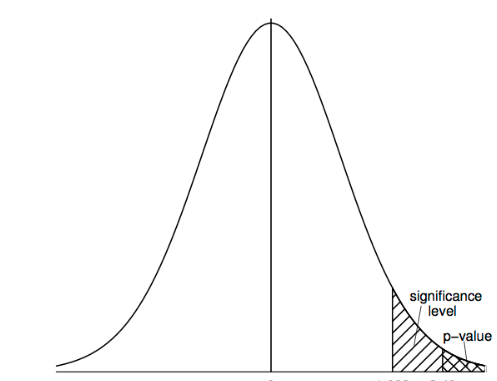
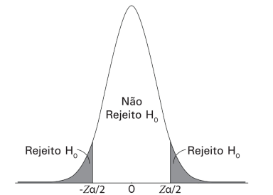
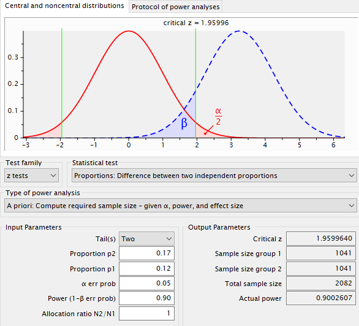
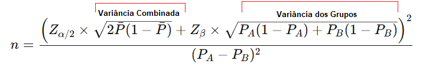

# Análise de Conversão de Clientes com Teste A/B, SQL e Python

## Resumo
Este projeto foi desenvolvido com base em dados gerados sinteticamente para fins de demonstração de análise estatística em um cenário de e-commerce. Os dados representam uma simulação cuidadosamente construída para refletir um caso prático e realista de aplicação de teste A/B.

Este projeto teve como objetivo avaliar, por meio de um teste A/B estatístico, se a inclusão de um voucher de 15% de desconto em uma comunicação promocional aumenta significativamente a taxa de conversão de clientes em um e-commerce, comparando com uma comunicação padrão, sem desconto.

A base do estudo partiu de uma taxa de conversão atual de 12%, e a meta era atingir pelo menos 17% com a ação promocional. Na base, incluímos 2100 clientes, divididos de forma aleatória e estratificada entre os grupos controle e teste (1050 cada), mantendo o equilíbrio por idade, gênero e ticket médio. Cada grupo recebeu a comunicação via e-mail ou WhatsApp, de forma igualmente distribuída.

Foi aplicado um teste Z para duas proporções, utilizando o Python e a biblioteca statsmodels. Os resultados mostraram que o grupo teste (com voucher) teve uma taxa de conversão de 42,86%, enquanto o grupo controle obteve apenas 10,95%. O valor-p foi praticamente nulo (4.74e-61), o que indica forte significância estatística. O intervalo de confiança de 95% para a diferença entre as proporções foi de (28,37%, 35,44%), o que significa que, em 95 de 100 experimentos semelhantes, o aumento real de conversão esperado ao usar o voucher estará dentro desse intervalo.

Além disso, foram feitas análises adicionais com SQL por canal, gênero, faixa etária e ticket médio. Observou-se que:
- O canal de envio (e-mail ou WhatsApp) teve pouca variação na taxa de conversão.
- O gênero não impactou significativamente a resposta à promoção.
- O grupo etário 18–25 anos apresentou a maior taxa de conversão.
- Clientes com ticket médio alto tiveram conversão levemente maior.
- O ticket médio do grupo teste foi inferior ao do controle (R$ 306 vs R$ 319), sugerindo que muitos compraram apenas o mínimo necessário para usar o cupom.

## 1 Introdução

Empresas de e-commerce estão constantemente em busca de estratégias para aumentar a conversão de clientes. Uma abordagem comum é o uso de campanhas de e-mail marketing oferecendo descontos e incentivos. Mas será que essas ofertas realmente impactam a decisão de compra dos consumidores?

Para responder a essa questão, criamos um cenário hipotético no qual uma empresa de e-commerce, que vende uma variedade de produtos, decidiu testar a eficácia de uma campanha promocional. O experimento foi conduzido por meio de um Teste A/B, no qual um grupo de clientes recebeu um voucher de 15% de desconto em compras acima de R$ 100, enquanto outro grupo recebeu apenas uma comunicação padrão, sem voucher.

Atualmente, a taxa de conversão dos usuários que recebem apenas a comunicação regular, cujo objetivo é reforçar a lembrança da marca e apresentar os produtos sem oferecer um incentivo direto para a compra, está em 12%. O teste tem como objetivo identificar se a inclusão do desconto pode gerar um aumento significativo na taxa de conversão e, consequentemente, impactar positivamente as vendas da empresa.

### 1.1 Teste A/B
O teste A/B é uma metodologia de experimentação utilizada para comparar duas versões de uma variável (como um site, campanha de marketing ou funcionalidade de um produto) e determinar qual gera melhores resultados. Ele é amplamente aplicado em áreas como marketing digital, experiência do usuário (UX), design de produtos e ciência de dados.

O teste A/B envolve a seleção aleatória de clientes para garantir que os grupos sejam homogêneos a fim de evitar vieses que possam distorcer os resultados. Ele é ideal para realizar comparações, pois, por exemplo, comparar grupos com base no tempo pode não ser adequado. A sazonalidade pode influenciar os resultados, tornando comparações temporais menos confiáveis. Assim, o teste A/B permite avaliar, dentro do mesmo período, os efeitos de uma ação em comparação à ausência dela, proporcionando resultados mais precisos e isentos de vieses temporais.

São observadas métricas-chave, como taxa de conversão, tempo de permanência e número de cliques. Os resultados são analisados para verificar se a diferença entre os grupos é estatisticamente significativa. Se o grupo de teste apresentar melhor desempenho, a mudança pode ser implementada permanentemente.

Além disso, **um teste A/B é um teste estatístico de proporção**, pois compara taxas de sucesso entre dois grupos distintos. No contexto de um experimento para avaliar o impacto de um voucher promocional, por exemplo, o que está sendo medido é a proporção de usuários que realizaram uma conversão em cada grupo. No grupo controle (sem voucher), temos uma taxa de conversão p1, enquanto no grupo de teste (com voucher), temos uma taxa de conversão p2. O objetivo do teste é verificar se a diferença entre essas proporções é estatisticamente significativa ou se pode ter ocorrido apenas por acaso.

Para isso, utiliza-se o Teste Z para proporções, uma técnica estatística apropriada para comparar duas taxas de sucesso em populações independentes. O uso do teste de proporções no teste A/B é essencial porque muitos experimentos desse tipo lidam com métricas binárias, como converteu/não converteu, clicou/não clicou ou abriu/não abriu, etc. Comparar médias nesses casos não seria adequado, pois o que realmente importa é a taxa de sucesso dentro de cada grupo. Dessa forma, o teste A/B fornece uma maneira robusta de determinar, com rigor estatístico, se uma mudança específica gera um impacto real na métrica avaliada.

### 1.2 Objetivo
- **O objetivo principal é verificar se a inclusão de um voucher promocional em uma comunicação aumenta a taxa de conversão dos usuários em comparação com uma comunicação sem voucher.**
    - A versão com voucher oferece um cupom de 15% de desconto em compras acima de R$ 100,00.
    - A versão sem voucher tem o propósito de gerar lembrança da marca e apresentar informações gerais sobre alguns produtos da empresa, sem oferecer um desconto direto.
-  **Métrica de sucesso:** A principal métrica de sucesso é a taxa de conversão, medida pelo percentual de compras realizadas após o recebimento da comunicação.

    - Fórmula para taxa de conversão: 
      - Taxa de conversão(voucher) = 
    (Usuários que compraram com o voucher/ Usuários que receberam a comunicação com o voucher) * 100
      - Taxa de conversão(sem voucher) = 
    (Usuários que compraram sem o voucher/ Usuários que receberam a comunicação sem o voucher) * 100
    - Aumento percentual na conversão:  
      - (Taxa conversão(voucher) - Taxa conversão(sem voucher)) * 100/ Taxa conversão(sem voucher)

- **Meta de conversão:** 17%

# 2 Visão geral de alguns conceitos

a) **Teste de Hipótese:**  Um teste de hipótese 
é um procedimento estatístico usado para avaliar se há evidências 
suficientes nos dados para rejeitar uma suposição inicial (hipótese nula) sobre
 uma população. Desta forma, utilizamos um teste de hipótese para avaliar 
 a validade de uma afirmação (hipótese) sobre um parâmetro populacional, 
 com base em dados amostrais.

 b) **Hipótese Nula (H0):** A hipótese nula representa o estado 
 padrão ou **a suposição inicial sobre os dados**. 
 Ela assume que não há efeito, mudança ou diferença real. 
 O objetivo do teste é tentar refutar essa hipótese com base nos dados.
 Ela contém uma afirmação de igualdade: (=, ≤ , ≥).

 c) **Hipótese Alternativa (H1 ou Ha):** A hipótese alternativa é a afirmação 
 oposta à hipótese nula. Ela sugere que existe um efeito, 
 uma diferença ou uma mudança real nos dados, ela contradiz H0 (≠, >, <).

 d) **Nível de significância:** O nível de significância (α)
 representa a probabilidade máxima de rejeitar a hipótese nula (H0) quando ela é verdadeira. Em outras palavras, é o risco que estamos dispostos a correr de cometer um **erro tipo I (falso positivo).**  
 
 Comum usar  α = 0.05 (5%): Significa que aceitamos um risco de 5% de rejeitar H0 ​indevidamente.

 Valores menores, como 0.01 (1%), reduzem o risco de erro tipo I, mas aumentam o risco de erro tipo II.

-   O Erro Tipo II (β) ocorre quando não rejeitamos a hipótese nula (H0) mesmo quando ela é falsa. Em outras palavras, é um falso negativo.   

 e) **p-valor:** O p-valor representa a probabilidade de observarmos os dados obtidos na amostra, ou resultados ainda mais extremos, assumindo que a  hipótese nula (H0) é verdadeira. Ou seja, qual a probabilidade 
 de encontrar uma diferença(entre os grupos) ou um valor mais extremo dado 
 que os grupos são iguais, dado que a diferença não existe. 

 Então, por exemplo, se definirmos o nível de significância em 0,05 e após a realização do teste o resultado do valor-p for de 0,02, isso significa que, se a hipótese nula for verdadeira (ou seja, se não existir diferença real entre os grupos), a probabilidade de obtermos o resultado encontrado ou ainda um valor tão extremo quanto o observado, é de apenas 2%. Como esse valor é menor que o nível de significância estabelecido (0,02 < 0,05), rejeitamos a hipótese nula e concluímos que há evidências estatísticas para acreditar que existe uma diferença real entre os grupos.

f) **Nível de confiança:**  O nível de confiança é complementar ao nível de significância: Nível de Confiança = 1 − α. Se 5 α = 0.05, então o nível de confiança é 1 − 0.05 = 0.95 (ou 95%). Isso significa que, se repetirmos o experimento várias vezes, esperamos que em 95% das vezes o intervalo de confiança contenha o verdadeiro valor do parâmetro populacional.  
-  **Importante:** O nível de confiança não significa que há 95% de chance de que o verdadeiro valor esteja dentro de um único intervalo específico. Em vez disso, significa que se repetirmos o estudo múltiplas vezes, 95% dos intervalos construídos conterão o verdadeiro valor.

g) **Distribuição da estatística do teste:** Em um teste de hipóteses, assume-se inicialmente que a hipótese nula (H0 ​) é verdadeira. Nos testes estatísticos, os valores extremos da distribuição representam resultados improváveis sob H0, 
. Se o valor obtido cair em uma dessas regiões extremas, concluímos que ele se desvia significativamente do esperado sob H0 ​ e, portanto, rejeitamos a hipótese nula.  

A região central da distribuição representa os valores que estão dentro da variação esperada caso H0 ​ seja verdadeira, e, nesses casos, não a rejeitamos. Como os testes estatísticos geralmente avaliam a existência de diferenças entre parâmetros, em **testes bilaterais**, a região de rejeição é dividida em duas partes (α/2 em cada extremo), pois a diferença pode ocorrer tanto para valores acima quanto abaixo do parâmetro de comparação.  

Desta forma, a conclusão de um teste estatístico é feita ao verificar se o valor calculado do teste cai na região de rejeição ou na região de não rejeição da hipótese nula, conforme a curva de probabilidades. Essas regiões são definidas com base no nível de significância (α) previamente estabelecido. Esse tipo de teste permite determinar se há evidências suficientes para rejeitar a hipótese nula, mas não mede diretamente a probabilidade de que os resultados tenham ocorrido por acaso.  
Distribuição da estatística do teste em um teste bilateral:

# 3 Planejamento do Estudo

### 3.1 Métrica de sucesso
 A principal métrica de sucesso é a taxa de conversão, medida pelo percentual de compras realizadas após o recebimento da comunicação.
 - Taxa de conversão atual em diferentes canais de comunicação  sem o voucher: 12%
 - Meta de conversão: 17%

### 3.2 Hipóteses do Teste

- Hipótese Nula (H0): Não há diferença significativa entre as taxas de conversão dos clientes que receberam o voucher e os que não receberam. 
    - H0: Taxa de Conversão (Voucher) = Taxa de Conversão (Sem Voucher)

- Hipótese Alternativa (HA): Há uma diferença significativa entre as taxas de conversão dos clientes que receberam o voucher e os que não receberam.
    - Ha: Taxa de Conversão (Voucher) ≠ Taxa de Conversão (Sem Voucher)

### 3.3 Público Alvo 
- Clientes que realizaram pelo menos uma compra nos últimos seis meses.

### 3.4 Amostragem Estratificada e Controle de Viés
A amostra será estratificada para evitar viés e garantir uma análise mais equilibrada:
-  Estratificação por Faixa Etária:
    - 18-25 anos: Jovens adultos, mais conectados digitalmente.
    - 26-45 anos: Alto consumo online, comportamento variado.
    - 46-60 anos:  Compradores experientes, poder aquisitivo maior.
    - Acima de 61 anos: Público crescente no e-commerce, hábitos de compra diferentes. [Referência: Sete em cada dez brasileiros com mais de 50 anos compram online pelo menos uma vez ao mês](https://oglobo.globo.com/economia/noticia/2024/05/23/sete-em-cada-dez-brasileiros-com-mais-de-50-anos-compram-online-pelo-menos-uma-vez-ao-mes.ghtml)

-  Estratificação por Ticket Médio (Histórico de Compras)
    - Baixo (Média de consumo < R$ 100,00): Clientes que costumam fazer compras pequenas e pontuais.
    - Médio (Média de consumo entre R$ 100,00 - R$ 300,00): Clientes com padrão de compra moderado.
    - Alto (Média de consumo acima de R$ 300,00): Clientes que gastam valores mais elevados ao longo do tempo.

- Estratificação por Gênero:
    - Homens
    - Mulheres

**A amostra será estratificada considerando idade, gênero e consumo médio na plataforma, garantindo equilíbrio na análise e eliminando vieses. A segmentação por idade permite avaliar diferenças de comportamento entre faixas etárias, enquanto a divisão por gênero assegura uma abordagem mais inclusiva. Além disso, em vez de considerar apenas a última compra, o consumo médio desde o cadastro na plataforma será utilizado, classificando os clientes em diferentes faixas de gasto e reduzindo distorções causadas por sazonalidade ou renda. Essa estrutura assegura uma amostra representativa e balanceada de cada grupo, permitindo uma análise mais precisa do impacto do voucher promocional.**

Os clientes também foram selecionados com base no grau de engajamento e interação. Foram escolhidos aqueles que possuem alto engajamento e que frequentemente abrem e interagem com as mensagens enviadas por WhatsApp ou e-mail. Essa seleção também ajuda a reduzir o viés entre clientes altamente engajados e aqueles com baixo engajamento, garantindo uma análise mais equilibrada e focada no público mais ativo.

### 3.5 Amostragem

Para garantir que um teste estatístico seja confiável e capaz de detectar diferenças entre grupos, é necessário calcular um tamanho mínimo de amostra adequado. Esse cálculo depende da diferença esperada entre os grupos, do nível de significância (α) e do poder estatístico (1−β). Se o tamanho da amostra for insuficiente, o estudo pode falhar em comprovar uma diferença real, tornando os resultados estatisticamente inconclusivos.  

Se realmente houver uma diferença entre as taxas de conversão dos grupos testados, o tamanho adequado da amostra garantirá que essa diferença possa ser detectada de forma estatisticamente significativa
- Componentes necessários para calcular o tamanho mínimo da amostra:

    - Tamanho do Efeito (Effect Size - ES): Refere-se à diferença esperada entre as taxas de conversão dos grupos. Quanto maior for a diferença esperada, menor pode ser a amostra necessária para detectar essa diferença com significância. Por outro lado, diferenças pequenas exigem amostras maiores para serem confirmadas estatisticamente
    - Nível de significância (α): Representa a probabilidade de erro tipo I, ou seja, a chance de rejeitar a hipótese nula quando ela é verdadeira. O valor de α mais comum em experimentos é 0,05 (5%)
    - Poder do teste (1−β): **Mede a capacidade do teste de detectar uma diferença real caso ela exista**, ou seja, se refere à probabilidade de um teste estatístico rejeitar corretamente a hipótese nula (H0) quando a hipótese alternativa (H1) é verdadeira. Um poder estatístico típico é de 80%, o que significa que o teste terá 80% de chance de detectar um efeito verdadeiro. O complemento disso (β) representa a probabilidade de erro tipo II, ou seja, a chance de não detectar um efeito verdadeiro.

#### 3.5.1 Tamanho do Efeito
O tamanho do efeito (Effect Size - ES), no contexto de um teste de hipóteses para taxas de conversão, é simplesmente a diferença entre a taxa de conversão atual e a taxa de conversão esperada (meta que queremos alcançar com a intervenção, como o uso do voucher promocional).   

#### 3.5.2 Nível de significância 

Para este teste, o nível de significância adotado será o convencionalmente utilizado em testes estatísticos, α = 0.05 (5%).

Isso significa que aceitaremos um risco de 5% de erro tipo I, ou seja, a chance de rejeitarmos a hipótese nula (H0) quando ela é verdadeira.

Se o valor-p obtido no teste for menor que 0.05, rejeitaremos 
H0, indicando que há evidências estatísticas significativas de que o voucher influencia a taxa de conversão. Caso contrário, se o valor-p for maior ou igual a 0.05, não rejeitaremos H0, concluindo que não há evidências suficientes para afirmar que o voucher tem um impacto significativo.

#### 3.5.3 Poder do teste (1−β)
Para garantir maior confiabilidade na detecção de um efeito real, será adotado um poder estatístico de 90%. Isso significa que o teste terá uma probabilidade de 90% de detectar uma diferença significativa entre os grupos caso essa diferença realmente exista. Um poder de 90% reduz a chance de cometer um Erro Tipo II (β), ou seja, a probabilidade de não detectar um efeito real quando ele de fato ocorre

#### 3.5.4 Cálculo de tamanho de amostra

Agora, para calcular o tamanho da amostra necessário, utilizaremos o software GPower, que nos ajudará a determinar o número de participantes com base no nível de significância, poder estatístico e tamanho do efeito desejados.

- Acesse o GPower: Abra o navegador e vá para o site do [GPower.](https://www.psychologie.hhu.de/arbeitsgruppen/allgemeine-psychologie-und-arbeitspsychologie/gpower)
- Baixe e Instale: Baixe a versão apropriada para o seu sistema operacional e instale o software.
- Inicie o GPower: Após a instalação, abra o programa.
- Selecione o Tipo de Teste: No menu principal, selecione o tipo de teste estatístico que você deseja realizar. 
- Escolha o Tipo de Análise de Poder: Selecione "A priori: Compute required sample size – given α, power, and effect size" para calcular o tamanho da amostra necessário com base no nível de significância (α), poder e tamanho do efeito.

- Insira os Parâmetros:
    - Tail(s): Aqui você seleciona se o teste é unilateral ("One") ou bilateral ("Two"). Um teste unilateral é usado quando a hipótese alternativa especifica uma direção (por exemplo, maior ou menor), enquanto um teste bilateral é usado quando a direção não é especificada.
    - Proportion p1: Este é o valor da proporção esperada no primeiro grupo.
    - Proportion p2: Este é o valor da proporção esperada no segundo grupo. 
    - α err prob: Este é o nível de significância, geralmente definido como 0.05.
    - Power (1–β err prob): Este é o poder estatístico desejado, geralmente definido como 0.80 ou 0.90.
    - Allocation ratio N2/N1: Este é a razão de alocação entre os tamanhos dos dois grupos. Um valor de 1 significa que os dois grupos terão o mesmo número de participantes.

**Resultado do cálculo amostral:**

#### 3.5.4.1 Exemplo de cálculo manual:
Fórmula para cálculo do tamanho da amostra para comparação de duas proporções independentes:

Referência: [Cálculo de Tamanho de Amostra - UFMG](https://www.est.ufmg.br/~enricoc/pdf/EstatisticaII/aula7-8.pdf)

- Z α/2 = 1.96 (para um nível de confiança de 95%)
- Zβ = 1.28 (para um poder estatístico de 90%)
- Proporção no grupo controle, PA = 0.12
- Proporção  no grupo teste, PB = 0.17
- Média das Proporções (P-) = 0.145

Cálculo da Variância Combinada  
2×0.145×(1−0.145) =   
2×0.145×0.855 =   
0.24795  

Cálculo da Soma das Variâncias Individuais  
0.12x(1-0.12)+0.17(1-0.17) =  
(0.12×0.88)+(0.17×0.83) =  
0.1056+ 0.1411 =   
0.2467  

Cálculo do Numerador:     
((1.96x√0.24795) + (1.28x√0.2467))²  =   
((1.96x0.49794578)+(1.28x0.496689037))² =   
(0.9759737229 + 0.635761968)² =     
1.611735691² =    
2.597691937  

Cálculo do Denominador:
(0.12−0.17)² = 0.0025

Cálculo final:  
2.597691937/ 0.0025 = 1039,077
 
Este valor é muito próximo do valor calculado pelo GPower =  1041.

###  3.6 Diferentes Canais de Comunicação
Cada grupo receberá a mesma comunicação, mas por canais diferentes, para avaliar qual meio tem maior impacto na conversão:
- E-mail 
- WhatsApp 

O objetivo é  medir o impacto do voucher e entender qual canal gera maior engajamento para diferentes perfis de clientes.

# 4 Visão geral e preparação dos dados

- **Fonte de Dados:** 
Os dados foram gerados sinteticamente com base em instruções fornecidas ao chatgpt, 
detalhando as tabelas e colunas desejadas para simular um cenário de um e-commerce. 
As tabelas principais incluem:
    - **Dim_Clients:** Dados sobre características dos clientes que entrarão no estudo. A tabela dim_clientes contém 2100 pessoas, com idades entre 18 e 75 anos, divididas igualmente em quatro grupos: 18-25, 26-45, 46-60 e acima de 61 anos, temos também a coluna ticket_medio com três categorias: baixo, médio e alto, cada uma com 700 pessoas. E a distribuição de gênero é equilibrada, com 1050 pessoas do gênero feminino e 1050 do gênero masculino.
    A ideia justamente é ter grupos homogêneos para evitar vieses no estudo.
    - **Fact_Conversions:** Registro dos clientes dos grupos de controle e teste, 
    indicando se realizaram uma conversão.
    Para gerar essa nova tabela, as seguintes instruções foram fornecidas: 2100 clientes foram divididos entre grupo teste e controle, sendo 1 representando o grupo teste e 0 o controle. A coluna conversion indica se o cliente converteu ou não. Para esse cenário, solicitei que aproximadamente 40% dos clientes do grupo teste (1050) tivessem conversão (em torno de 450 clientes), enquanto o grupo de controle(1050) teve cerca de 10% de conversão (em torno de 115 clientes). Além disso, a tabela inclui uma coluna para o canal de comunicação (whatsapp ou email), que foi dividido igualmente entre os grupos.
    - **Fact_Orders:** Para a tabela fact_orders, foram resgatados os IDs dos clientes que converteram, com base na tabela fact_conversions. Essa tabela contém os detalhes dos pedidos, como o valor da compra e a data em que ela foi realizada.
    

Os dados gerados estão no formato CSV.
Antes do carregamento dos arquivos CSV, foram criadas as tabelas no **PostgreSQL**, 
garantindo que todas as chaves primárias (PK) e chaves estrangeiras (FK) estivessem 
corretamente definidas.
Após a criação das tabelas, os dados foram inseridos a partir de arquivos CSV.
Utilizamos a importação direta via interface gráfica no pgAdmin.

### 4.1 Preparação dos  Dados

- **Armazenamento:** Os dados são carregados no PostgreSQL.
- **Transformação dos Dados:** Integramos o banco de dados ao Python para executar as análises e 
transformações necessárias com linguagem SQL e responder às questões de negócio. 
- **Análise Estatística no Python:** Aplicamos o teste A/B para validar os resultados.
 
# 5. Análises

### 5.1 Perguntas de Negócios

1. Análise de Conversão:  
    - Qual a taxa de conversão geral dos clientes?  
    - Há uma diferença significativa na taxa de conversão entre o grupo controle e o grupo teste?
    - Qual canal de comunicação apresenta a maior taxa de conversão?

2. Segmentação de Clientes e comportamento de compra:  
    - De que forma idade, gênero ou valor do ticket médio impactam a taxa de conversão?  
    - Como idade influencia o valor médio do pedido?
    - Os clientes do grupo de teste apresentam um ticket médio maior do que os do grupo controle?

### 5.2 Teste de Hipótese:
- Há uma diferença significativa entre as taxas de conversão dos clientes 
que receberam o voucher e os que não receberam?
    - H0: Taxa de Conversão (Voucher) = Taxa de Conversão (Sem Voucher)
    - Ha: Taxa de Conversão (Voucher) ≠ Taxa de Conversão (Sem Voucher)

### 5.3  Intervalo de Confiança:
 O intervalo de confiança e o teste de hipótese são duas abordagens diferentes para responder a perguntas sobre parâmetros populacionais (como médias, proporções, etc.), mas estão intimamente relacionados. Ambos usam a mesma distribuição amostral do estimador (por exemplo, a diferença entre proporções) e estão baseados nos mesmos princípios estatísticos. Inclusive, conseguimos substituir um teste de hipótese por um intervalo de confiança.

Vantagem do Intervalo de Confiança: O intervalo de confiança não apenas indica se há uma diferença significativa, mas também quantifica a magnitude dessa diferença e a incerteza associada, ele também é mais fácil de interpretar que o valor de p. 

Ele fornerce uma faixa de valores plausíveis para a diferença entre as proporções (p1 ​ −p2) com um certo nível de confiança (por exemplo, 95%). Se o intervalo de confiança não incluir o zero, isso significa que, com 95% de confiança, a diferença entre as proporções não é zero. Em outras palavras, há evidências estatísticas de que as proporções são diferentes.

# 6. Análise dos Resultados

Nesta seção, apresentamos os resultados estatísticos e a interpretação dos dados analisados com SQL a partir do experimento A/B, além de possíveis implicações para estratégias de negócios no e-commerce.

### 6.1 Resultados do Teste Estatístico

Foi aplicado um teste Z para duas proporções independentes com os seguintes dados:

- Grupo Controle: 115 conversões de 1050 clientes (Taxa de conversão = 10,95%)
- Grupo Teste: 450 conversões de 1050 clientes (Taxa de conversão = 42,86%)

Resultado do teste Z:
- Estatística Z = 16.4845
- Valor-p = 4.7412e-61
- Intervalo de confiança (95%) para a diferença entre as proporções = (0.2837, 0.3544)

#### 6.1.1 Interpretação:

- Como o valor-p é muito menor que 0.05, rejeitamos a hipótese nula (H0).
- O intervalo de confiança não inclui o zero, o que confirma que a diferença entre as taxas de conversão é estatisticamente significativa.
- Com isso, temos fortes evidências de que o uso do voucher aumentou significativamente a conversão dos clientes.
- A interpretação do intervalo de confiança indica que, em 95 de 100 experimentos semelhantes, o aumento real na conversão devido ao voucher estará entre 28,37% e 35,44%. Isso fornece uma estimativa confiável do impacto esperado caso essa estratégia seja aplicada em novos cenários.

### 6.2 Conversão por Grupo e Canal
- Conversão Geral: 26,9%
- Grupo Teste: 42,86%
- Grupo Controle: 10,95%
- E-mail: 27,14%
- WhatsApp: 26,67%

Apesar de os canais (e-mail e WhatsApp) apresentarem conversões similares, o impacto do voucher foi muito mais significativo do que o canal utilizado.

Implicação para o negócio: O canal de comunicação, isoladamente, parece não influenciar a conversão de forma relevante. Dessa forma, as empresas podem escolher o canal com melhor custo-benefício ou que ofereça melhor taxa de entrega, sem comprometer a performance da campanha.

### 6.3 Conversão por Segmento

#### 6.3.1 Por Gênero:
- Feminino: 27,14%
- Masculino: 26,67%

As taxas são bastante semelhantes entre os gêneros, indicando que o efeito do voucher foi consistente.  

Implicação para o negócio: Estratégias promocionais com cupons de desconto parecem ser igualmente eficazes entre homens e mulheres, não sendo necessário customizar esse tipo de benefício por gênero.

#### 6.3.2 Por Faixa Etária:
- 18–25: 28%
- 26–45: 25,71%
- 46–60: 26,86%
-  Mais de 60: 27,05%

As diferenças são pequenas, mostrando que o efeito do voucher ocorreu de forma semelhante em todas as faixas etárias.

Implicação para o negócio: O voucher pode ser aplicado de forma ampla para diferentes faixas etárias, já que seu impacto foi relativamente uniforme. Entretanto, como os mais jovens (18–25) apresentaram a maior taxa, pode ser interessante criar comunicações específicas para este grupo, explorando a linguagem e canais que mais utilizam.

#### 6.3.3 Por Ticket Médio:
- Baixo: 26,71%
- Médio: 25,43%
- Alto: 28,57%

Clientes com maior ticket médio tiveram uma taxa de conversão levemente superior.

Implicação para o negócio: Os clientes que já possuem maior histórico de compras tendem a responder melhor a incentivos. A empresa pode considerar ações personalizadas com valores de cupons escalonados por perfil de ticket médio.

### 6.4 Análise do Ticket Médio por Grupo
- Grupo Controle: R$ 319,12
- Grupo Teste: R$ 306,00

Apesar do grupo teste ter convertido mais, o ticket médio foi ligeiramente menor. Isso pode ser explicado pelo incentivo do cupom, que estimula compras próximas ao valor mínimo de R$ 100 para obtenção do desconto.

Implicação para o negócio: O aumento da conversão veio acompanhado de um pequeno recuo no ticket médio. Isso reforça a importância de calibrar o valor mínimo de compra para uso do cupom, de modo a evitar que clientes "comprem apenas o necessário" para obter o desconto.

# 7 Conclusão Geral e Recomendações

O teste A/B indicou com forte evidência estatística que o voucher de 15% aumentou significativamente a taxa de conversão. O efeito foi consistente entre diferentes faixas etárias, gêneros e perfis de ticket médio, validando a eficácia da campanha promocional.

Recomendações:
- Manter campanhas com voucher para públicos amplos, pois seu efeito foi generalizado.
- Avaliar o valor mínimo para uso do cupom, buscando equilibrar volume de conversões e ticket médio.
- Seguir usando WhatsApp e e-mail, priorizando o canal com melhor entrega e engajamento, já que ambos se mostraram equivalentes.
- Explorar segmentações por ticket médio e idade, desenvolvendo campanhas específicas para clientes de alto valor ou para grupos jovens mais responsivos.

Esse experimento reforça como a experimentação controlada (teste A/B) pode oferecer respostas práticas e confiáveis para tomada de decisão em e-commerce.

Autor:
Leticia da Luz

